<h1 align="center">
  
</h1>

  
  
  
  

### 👋 About Me
- Currently working on: **Real-time systems with WebSockets**
- Learning: **System Design & Advanced Backend Architecture**
- Fun fact: **Late-night debugging > daytime coding**

### 🛠️ Tech Stack

### 🚀 Featured Projects
- **[Zathura](https://zathura.onrender.com/)** - Full-stack accommodation booking platform *(Node.js, Express, MongoDB, Mapbox)* | [Demo](https://zathura.onrender.com/) | [Code](https://github.com/Atryee-Chatterjee/Zathura)
- **[AskMeMaybe](https://askmemaybe.onrender.com/)** - AI-Powered RAG-Based PDF Question Answering System *(Python, Flask, FAISS, LLaMA 3)* | [Demo](https://askmemaybe.onrender.com/) | [Code](https://github.com/Atryee-Chatterjee/AskMeMaybe/)
- **[SpamNix](https://spamnix.onrender.com/)** - AI-Powered Spam Detection System *(Flask, Python, Scikit-learn, NLTK)* | [Demo](https://spamnix.onrender.com/) | [Code](https://github.com/Atryee-Chatterjee/SpamNix)

---
### 📊 GitHub Stats & Activity

  

  

  

  

  <i><b>"Vision without execution is hallucination, Execution without a vision is just blind foolishness."</b></i>
    
  

